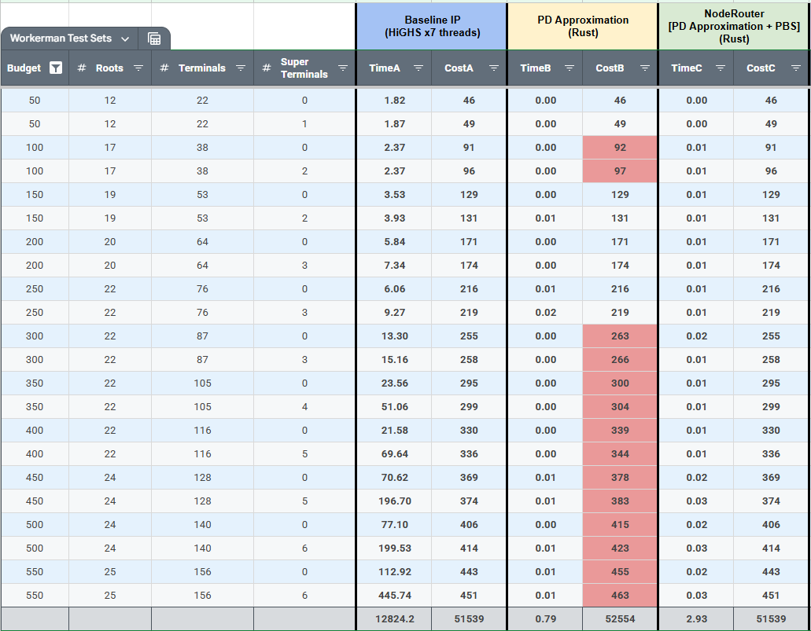
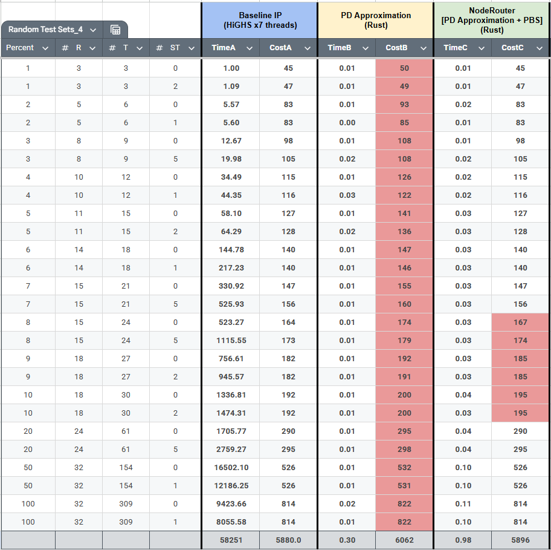

BDO-NodeRouter solves Multi-Commodity Flow Problems for node-weighted Steiner forests
for optimal and approximated path routing. The project is explicitly aimed at
solving on a relatively small (~800 nodes) planar graph from Black Desert Online
but could easily be modified to handle larger planar graphs.

To see the graph and nodes as well as view the routing in action visit Shrddr's
fantastic [Workerman](https://shrddr.github.io/workerman/) empire planner.

\* Scroll to the bottom of this file to see the testing results.

# Usage notes:

- Requirements:
  - nightly for coroutines

  `rustup install nightly`

## WASM

- Requirements:
  - wasm-pack for wasm
  - python to run the demo (or some other mini server)

`cargo install wasm-pack`

`rustup target add wasm32-unknown-unknown`

- Build for wasm using

`wasm-pack build --release --target web --features wasm`

- To run the wasm demo after building:

```
> cp -Rf ./pkg ./demo/pkg
> cd demo
> python -m http.server 8080
```

or on Windows...

```
> Copy-Item -Path ".\pkg" -Destination ".\demo\pkg" -Recurse -Force
> cd demo
> python -m http.server 8080; Start-Process http://localhost:8080
```

Then load the clean exploration.json from `python/bdo_noderouter/data`.
Lastly input terminal,root pairs (as waypoint ids) and hit solve.

## Python

- Requirements:
  - python
  - uv
  - maturin for python

Setup project dependencies (you may need to setup a .venv if uv doesn't just do it for you):

`uv sync`

Build for Python using:

`maturin develop --profile release --features python --uv`

### Demo scripts...

#### `mip_baseline.py`

The HiGHS linear optimization software is used when running the `mip_baseline.py`
script. It utilizes the solver configuration in the `config.toml` file and
can be configured to use multiple threads. When multiple threads are used the
`solve()` function coordinates solution sharing between the threads to dramatically
improve runtime. Big shout out to mathgeekcoder on the HiGHS discord server for
providing the inspiration for the solution sharing setup and other HiGHS callback
uses.

The problem is modelled as a Multi-Commodity Flow Problem with
reverse flow and a 'super root' to allow 'super terminals' to connect to any
potential base town.

**The `mip_baseline` solution is the optimal solution.**

`.venv/bin/python python/bdo_noderouter/mip_baseline.py`

#### `pd_approximation.py`

The `pd_approximation.py` script uses the a Python implementation of the Primal Dual
Approximation algorithm along with the Pulsing-Bridge Spanners (PBS) heuristic
both written in Python. The heuristic uses a Rust implementation of the IDTree
for constant-time connectivity testing...

`.venv/bin/python python/bdo_noderouter/pd_approximation.py`

#### `node_router.py`

The `node_router.py` script is a wrapper around the full Rust implementation
of the Primal Dual Approximation and the Pulsing-Bridge Spanners along with the
Rust implementation of the IDTree.

`.venv/bin/python python/bdo_noderouter/node_router.py`

#### `visualize_solution.py`

Node: To see the terminal pairs and solution waypoints edit the
`pd_approximation.toml` logger level to 'INFO'.

Once you are able to see the terminal, root pair and solutions you can
visualize them by editing the two indicated lines near the bottom of
`visualize_solution.py`.

`.venv/bin/python python/bdo_noderouter/visualize_solution.py`

This will open a browser instance for with an interactive map.

## Credits

The performance of this project is made possible by:

- [Rustworkx](https://github.com/Qiskit/rustworkx) in Python and
  [Petgraph](https://github.com/petgraph/petgraph) in Rust.
  Rustworkx is built on top of Petgraph.

- IDTree data structure as presented in
  Xu, Lantian, et al.
  "Constant-time Connectivity Querying in Dynamic Graphs."
  Proceedings of the ACM on Management of Data 2.6 (2024): 1-23.

- Node Weighted Primal Dual Approximation as given in 
  Demaine, Erik D., MohammadTaghi Hajiaghayi, and Philip N. Klein.
  "Node-weighted Steiner tree and group Steiner tree in planar graphs."
  International Colloquium on Automata, Languages, and Programming.
  Berlin, Heidelberg: Springer Berlin Heidelberg, 2009.

- [HiGHS linear optimization software](https://highs.dev/)
  Parallelizing the dual revised simplex method,
  Q. Huangfu and J. A. J. Hall,
  Mathematical Programming Computation, 10 (1), 119-142, 2018.

- Pulsing-Bridge Spanners (PBS), a novel augmentation/pruning heuristic
introduced by this project for node-weighted Steiner forests. It temporarily
inserts targeted multi-node “spanning bridges” between nodes in the graph to
induce beneficial cycles, then selectively prunes non-articulation points to
reduce cost without breaking connectivity.

NOTE: To my knowledge the implementation of the IDTree is a first in the public
domain and Lantian Xu was helpful in providing reference material and a C++
implementation of the paper's DSTree data structure.

## Performance and Results

The [bdo-Empire](https://github.com/Thell/bdo-empire) project optimizes a full
Empire. A modified version that batch processes budgets and super terminal
introduction was used to obtain optimal results for each budget from 5 to 550
"contribution points" (an in-game point system players can use to build-up their
empires) which resulted in a wide variety of test sets to test the
NodeRouter with. The NodeRouter uses the terminal, root assignments of the
optimal results to process only the transit routing portion of the problem.

The first image are the timings and results of a sampling of those tests.
The optimal solution input files are available in the `workerman` directory
of the Python project's data folder and took multiple days of processing to
produce.


The next image is the timings of random terminal, root assignments representing
a percentage of coverage of all available terminals



## TODO

- Post approximation augment/prune of leaf super terminals to nearest base town.

  Consider R_1 - T_1 - _5_ - ST - _4_ - B. When T_1 <-> ST will go tight prior
  to ST <-> B because B is not violated and will not expand.
  By selecting leaf super terminals and doing a BFS for the nearest R, T or B
  the post pruned approximation can have the path (ST, B) inserted as a bridge
  and remove_removables can be run. If the approximation solution is improved
  then ST is promoted to a T and assigned B as a root which is placed in
  untouchables and removables is updated with the intermediate nodes on that
  path.

- Finish studying the implementation details of scip-jack and process each
  terminal set cluster identified by the NodeRouter as a final pass to improve
  the solutions that the pulsing-bridge spanner obtains.
